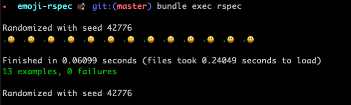
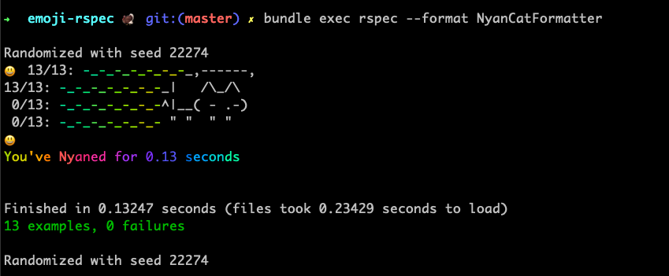

## Emoji RSpec Formatter

Install gems:
```
bundle install
```

To run:
```
bundle exec rspec
```

To use nyan-cat-formatter

```
bundle exec rspec --format NyanCatFormatter
```

## Screenshot



## Bonus nyan cat


